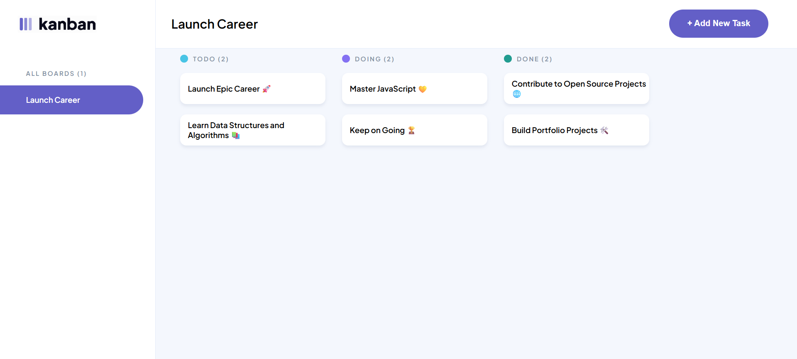
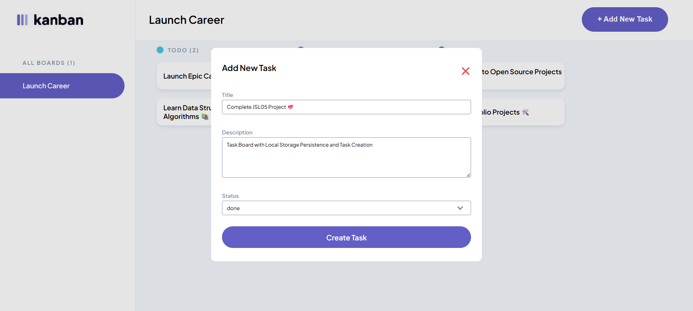
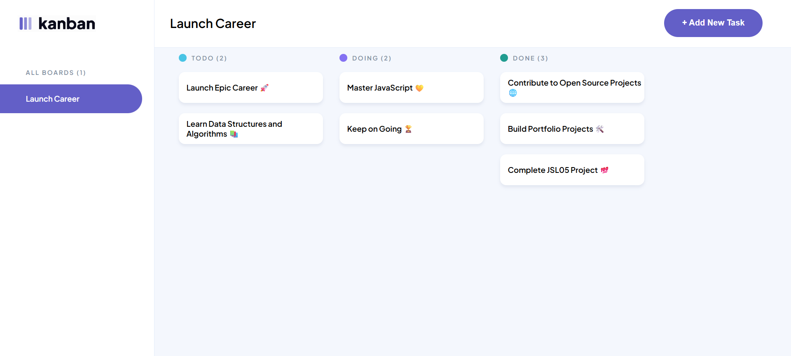

# Kanban Task Management Board

A Kanban-style task management application for organising tasks across three columns: **todo**, **doing**, and **done** — with localStorage persistence.

The project focuses on modular JavaScript architecture, DOM manipulation, and data persistence, while maintaining a clean and responsive user interface.

---

## Technologies Used

- HTML5 - Semantic markup and `<dialog>` element for modals
- CSS3 - Flexbox, CSS Grid, and responsive media queries
- JavaScript - (ES6+) Modules, array methods, DOM manipulation, event handling
- localStorage API - Client-side data persistence

---

## Features

- **Task Persistence** - Tasks load from localStorage on page load and save automatically when added. Falls back to initial data if no stored tasks exist.
- **Task Creation** - Click "Add New Task" to open a modal and enter a title, description, and status (todo / doing / done). Tasks appear instantly without a page refresh.
- **Task Organisation** - Tasks are automatically sorted into their respective columns, with column headers showing live task counts.
- **Task Viewing** - Click any task card to open a modal displaying its title, description, and status.
- **Responsive Design** - Responsive layout, the sidebar adapts for tablet and mobile, and the "Add Task" button adjusts on smaller screens.

---

## Setup

1. Clone the repository:

```bash
   git clone https://github.com/mughammadcase/MUGCAS25563_PTO2508_Mughammad_Case_JSL05.git
```

2. Navigate into the project folder and open it in your code editor.

3. Right-click `index.html` and select **Open with Live Server**.

---

## Usage

**Adding a task**

1. Click the **+ Add New Task** button.
2. Fill in the title, description, and select a status.
3. Click **Create Task** - it should appear in the correct column immediately.

**Viewing a task**

- Click any task card to open a modal showing its title, description, and status.

**Data persistence**

- Tasks are saved to localStorage automatically. Refreshing or reopening the browser will restore all previously added tasks.

---

## Screenshots

**Initial Task Board**



**Adding New Tasks**



**Persistence After Refreshing**



## Additional Notes

- localStorage serves as the single source of truth for all task data.
- Code is structured modularly with each file handling a single responsibility.

---
